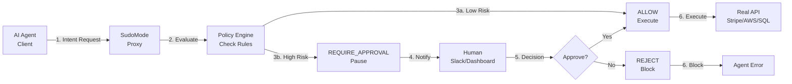

# 🛡️ SudoMode

> **The Missing `sudo` Command for AI Agents**

[](https://opensource.org/licenses/MIT)
[](https://www.python.org/downloads/)
[]()

**Stop your AI Agent from draining your bank account.** SudoMode is a middleware proxy that intercepts high-risk actions and enforces human approval before execution. Your agent sends intents, we hold the keys.

 **☁️ Hosted Cloud:** Don't want to self-host? [Join the SudoMode Cloud Waitlist](https://forms.gle/LzsMBGyvDtCvFMjn6)

---

## 🎬 Demo

**[Insert 30s Loom Video Here]**

**Quick Install:**
```bash
pip install sudomode
# or
git clone https://github.com/yourusername/sudomode-ai.git
cd sudomode-ai
```

---

## ⚠️ The Problem

**AI Agents are dangerous.** Prompt injection is real. You can't trust an LLM with `db.drop_table()` or `stripe.charge(amount=999999)`. 

Your agent has **direct access** to:
- 💳 Payment APIs (Stripe, PayPal)
- 🗄️ Databases (SQL, MongoDB)
- ☁️ Cloud Services (AWS, GCP)
- 🔐 Authentication Systems

**One prompt injection, one bug, one hallucination = catastrophic damage.**

---

## ✅ The Solution

**SudoMode holds the keys.** Your agent only sends **intents** (what it *wants* to do). We:

1. **Intercept** the action before execution
2. **Evaluate** it against your policy rules
3. **Pause** execution if high-risk
4. **Notify** humans (Slack, Dashboard)
5. **Execute** only after approval

**The agent never touches the real API until you say so.**

---

## 🏗️ Architecture



**Flow:**
1. Agent calls `sudo.execute("stripe.charge", {"amount": 5000})`
2. SudoMode evaluates against `policies.yaml`
3. High-value charge → **REQUIRE_APPROVAL**
4. Request appears in Dashboard + Slack notification
5. Human approves/rejects
6. Agent receives decision and proceeds or fails

---

## ✨ Key Features

- 🛡️ **Intent-Based Policy** - Define rules in YAML. No code changes needed.
- ⏸️ **Long-Polling Execution** - Agent pauses and waits for approval automatically.
- ⚡ **Real-time Dashboard** - React UI for monitoring and approving requests.
- 🔔 **Slack Integration** - Get notified instantly when approval is needed.
- 🐍 **Python SDK** - One-line integration: `sudo.execute(resource, action, args)`
- 🔒 **Fail-Safe Default** - Default deny. Only explicitly allowed actions proceed.
- 📊 **Request Tracking** - Full audit trail of all governance decisions.
- 🚀 **Zero Config** - Works out of the box with sensible defaults.

---

## 🚀 Quick Start

### Step 1: Clone & Install

```bash
git clone https://github.com/yourusername/sudomode-ai.git
cd sudomode-ai

# Backend Server
cd server
python3.11 -m venv venv  # Python 3.11 or 3.12 recommended
source venv/bin/activate  # Windows: venv\Scripts\activate
pip install -r requirements.txt

# Dashboard (optional)
cd ../dashboard
npm install

# SDK (Client Library)
cd ../sdk
pip install -r requirements.txt
# Or install as package: pip install -e .
```

### Step 2: Define Your Policy

Create `server/policies.yaml`:

```yaml
rules:
  # Allow read operations
  - name: "allow_read"
    resource: "database"
    action: "read"
    decision: "ALLOW"
    reason: "Read operations are safe"

  # Block destructive operations
  - name: "deny_delete"
    resource: "database"
    action: "delete"
    decision: "DENY"
    reason: "Delete operations are forbidden"

  # Require approval for high-value charges
  - name: "require_approval_high_amount"
    resource: "stripe.charge"
    action: "charge"
    condition: "args.amount > 50"
    decision: "REQUIRE_APPROVAL"
    reason: "High-value charge requires human approval"

  # Auto-approve low-value charges
  - name: "allow_low_amount"
    resource: "stripe.charge"
    action: "charge"
    condition: "args.amount <= 50"
    decision: "ALLOW"
    reason: "Low-value charge auto-approved"
```

### Step 3: Start the Server & Dashboard

```bash
# Terminal 1: Start backend
cd server
uvicorn app.main:app --reload

# Terminal 2: Start dashboard (optional)
cd dashboard
npm run dev
```

**Server:** `http://localhost:8000`  
**Dashboard:** `http://localhost:5173`

**Note:** Python 3.11 or 3.12 is recommended. Python 3.14 has compatibility issues with pydantic-core.

### Step 4: Use in Your Agent

**The Client Code:**

```python
from sudomode import SudoClient

# Initialize client
sudo = SudoClient(base_url="http://localhost:8000")

try:
    # Check permission before executing
    result = sudo.execute(
        resource="stripe.charge",
        action="charge",
        args={"amount": 5000}
    )
    
    if result:
        # Permission granted - proceed with actual Stripe charge
        print("✅ Charge approved, executing...")
        # stripe.Charge.create(amount=5000, ...)
        
except PermissionError as e:
    # Permission denied
    print(f"⛔ Blocked: {e}")
    
except BlockingIOError as e:
    # Approval required - agent pauses and waits
    print(f"⏳ Waiting for approval: {e}")
    # Request appears in dashboard
    # Human approves/rejects
    # Agent automatically resumes
```

**That's it.** Your agent is now protected.

---

## 📋 Roadmap

### ✅ Current Features
- [x] Policy engine with YAML configuration
- [x] Python SDK with long-polling
- [x] Real-time React dashboard
- [x] Slack notifications
- [x] Request tracking and audit trail
- [x] RESTful API

### 🚧 Coming Soon
- [ ] Docker Compose setup
- [ ] Hosted cloud version
- [ ] Webhook callbacks for approvals
- [ ] Multi-tenant support
- [ ] Advanced policy conditions (regex, time-based)
- [ ] Integration with more services (AWS SDK, etc.)
- [ ] Go/TypeScript SDKs
- [ ] Policy versioning and rollback

### 💡 Future Ideas
- [ ] AI-powered risk scoring
- [ ] Automated policy suggestions
- [ ] Integration with CI/CD pipelines
- [ ] Compliance reporting (SOC2, GDPR)

**Have a feature request?** [Open an issue](https://github.com/yourusername/sudomode-ai/issues)

---

## 🤝 Contributing

We welcome contributions! See [CONTRIBUTING.md](CONTRIBUTING.md) for guidelines.

**Quick contribution steps:**
1. Fork the repository
2. Create a feature branch (`git checkout -b feature/amazing-feature`)
3. Commit your changes (`git commit -m 'Add amazing feature'`)
4. Push to the branch (`git push origin feature/amazing-feature`)
5. Open a Pull Request

---

## 📚 Documentation

- **[API Documentation](http://localhost:8000/docs)** - Full API reference (when server is running)
- **[SDK Examples](sdk/examples/)** - More code examples including `demo_agent.py` and `bank_agent.py`
- **[Policy Reference](server/policies.yaml.example)** - Policy configuration guide
- **[Contributing Guide](CONTRIBUTING.md)** - How to contribute to SudoMode

## 🔧 SDK Installation

Install the SDK as a package:

```bash
cd sdk
pip install -e .
```

Or use directly:

```bash
cd sdk
pip install -r requirements.txt
python examples/demo_agent.py
```

## 🖥️ Dashboard Features

The React dashboard provides:
- **Real-time Updates** - Automatically polls the backend API every 2 seconds
- **Dark Theme** - Cyberpunk/enterprise security aesthetic
- **Request Management** - View, approve, or reject pending governance requests
- **Risk Indicators** - Visual badges showing risk levels
- **Responsive Design** - Works on desktop and mobile devices

**API Endpoints Used:**
- `GET /v1/requests` - Fetch all requests
- `POST /v1/requests/{id}/approve` - Approve a request
- `POST /v1/requests/{id}/reject` - Reject a request

---

## 🔐 Security

**SudoMode is security-first:**

- ✅ Default deny policy (fail-safe)
- ✅ Policy evaluation before execution
- ✅ Human-in-the-loop for high-risk actions
- ✅ Full audit trail
- ✅ No agent code changes required

**But remember:** SudoMode is a tool, not a silver bullet. Always:
- Review your policies regularly
- Monitor the dashboard for suspicious activity
- Use strong authentication for the dashboard
- Keep SudoMode server secure
- Never commit `.env` files with real API keys

## 🔔 Slack Integration (Optional)

To enable Slack notifications:

1. Create a Slack app at https://api.slack.com/apps
2. Enable "Incoming Webhooks"
3. Add webhook to your workspace
4. Create `server/.env`:
   ```bash
   SLACK_WEBHOOK_URL=https://hooks.slack.com/services/YOUR/WEBHOOK/URL
   ```

When an action requires approval, SudoMode will automatically send a formatted alert to your Slack channel.

---

## 📄 License

This project is licensed under the **MIT License** - see the [LICENSE](LICENSE) file for details.

---

## 🙏 Acknowledgments

Built with:
- [FastAPI](https://fastapi.tiangolo.com/) - Modern Python web framework
- [React](https://react.dev/) - UI library
- [Tailwind CSS](https://tailwindcss.com/) - Styling

---

## 💬 Community

- **Issues:** [GitHub Issues](https://github.com/yourusername/sudomode-ai/issues)
- **Discussions:** [GitHub Discussions](https://github.com/yourusername/sudomode-ai/discussions)
- **Email:** Info.namansharma001@gmail.com

---

**Made with ❤️ for safer AI agents**

**Stop trusting. Start governing.** 🛡️
